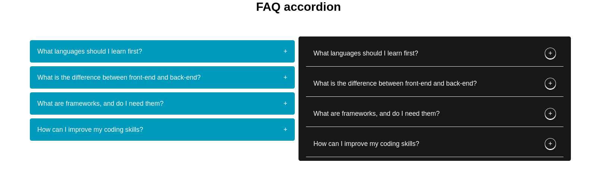
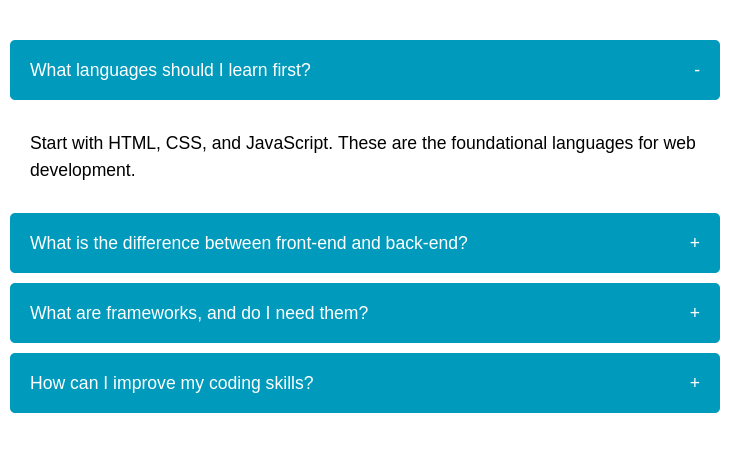

# FAQ Accordion

## Description

This is a FAQ accordion that can be used to display FAQ questions and answers. It is responsive and can be customized to fit your needs.

## screenshot

## Setup

1. Clone the repository
2. Open the index.html file in your browser

## Author

[Nesrya](https://github.com/NesryaAbdulkadir)
